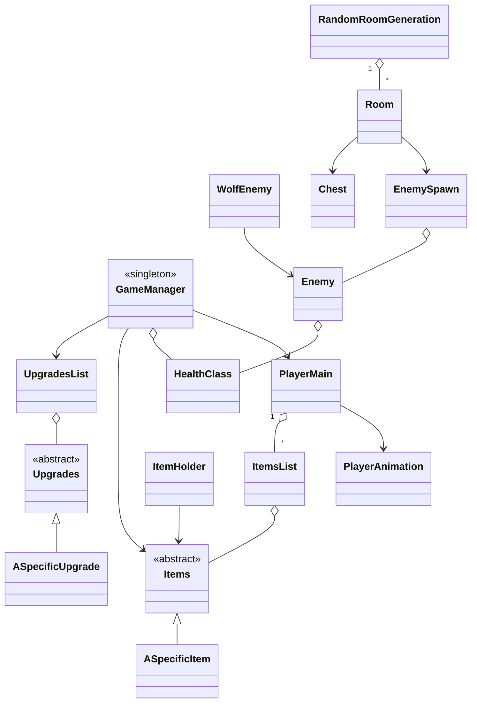

# Code OOP Diagram

Below is a simplified class diagram representing main classes and relationships, 

```mermaid
classDiagram
   class GameManager {
         <<singleton>>
        
    }

    class PlayerMain {
    
    }

    class PlayerAnimation {
    }

    class Enemy {
    }

    class WolfEnemy {
    }

    class HealthClass {
    }

    class Items {
        <<abstract>>
    }

    class ItemsList {
    }

    class ItemHolder {
    }

    class Upgrades {
        <<abstract>>
    }

    class UpgradesList {
    }

    class RandomRoomGeneration {
    }

    class Room {
    }

    class EnemySpawn {
    }

    class ASpecificItem{

    }

    class ASpecificUpgrade{

    }

    GameManager --> PlayerMain 
    GameManager o-- HealthClass 
    PlayerMain --> PlayerAnimation 
    PlayerMain "1" o-- "*" ItemsList 
    ItemsList o-- Items 
    ItemHolder --> Items
    Enemy o-- HealthClass
    EnemySpawn o-- Enemy
    WolfEnemy --> Enemy 
    GameManager --> Items
    GameManager --> UpgradesList
    UpgradesList o-- Upgrades
    RandomRoomGeneration "1" o-- "*" Room
    Room --> EnemySpawn 
    Room --> Chest
    Items <|-- ASpecificItem
    Upgrades <|-- ASpecificUpgrade
    
        
        
```
